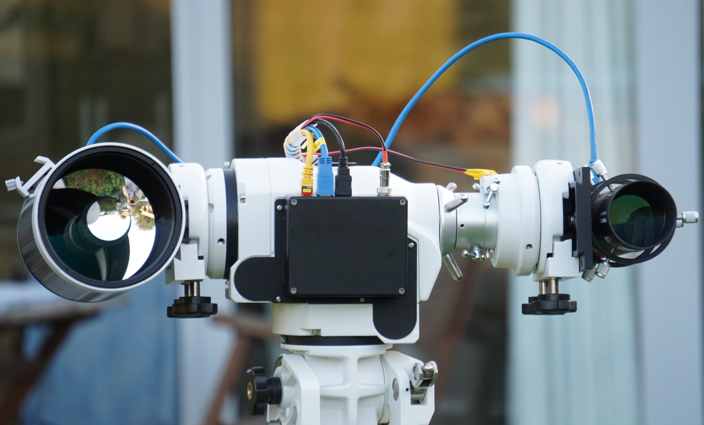
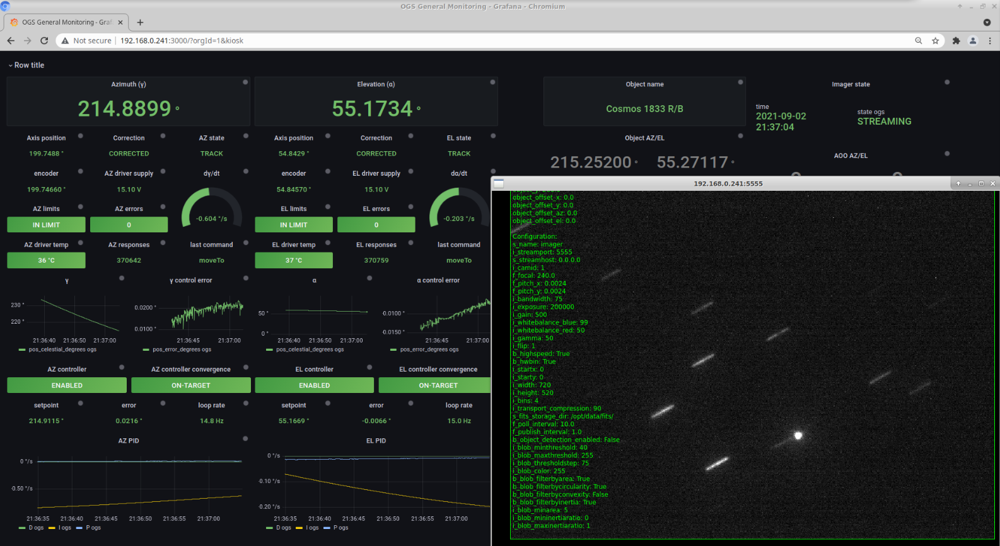

# mini-ogs
Repository for a Raspberry Pi based advanced mini optical ground station.



## Hardware

The hardware consists of COTS Azimuth/Elevation mount retrofitted with industrial grade servo drives, encoders and optics / high-speed USB3.0 imagers. A Raspberry Pi 4 is used to run the setup.

## Software

The software layer consists of a number of threads, each controlling a device or subsystem using a finite state machine and a dedicated library for interacting with the hardware. Generic system level functions of these threads are protected by Mutexes where necessary and functionality exposed to an Asynchronous Server Gateway Interface (FastAPI). Fucntions can be executed in realtime through the API, or with a Time Tag (preprogrammed operations). All system level interactions are facilitated via 'Jobs' using APscheduler.

Grafana Live is used to visualise system status and is provisioned via websockets/Telegraf to achieve high update rates in a browser.



A single docker-compose file is used to bring up the system.

### Preparation

Pull existing image:
```
 docker pull grafana/grafana:8.0.3
```

build custom images:
```
 docker build . -t ogs-core --file Dockerfile_ogs-core
 docker build . -t telegraf-python:1.19.1 --file Dockerfile_telegraf
``` 


### Operations

Start the docker containers using the wrapper script:
```
 ./start.sh
```

Stop and remove all containers using the wrapper script:
```
 ./stop.sh
```

## TODO
- Add H/W diagram and additional details
- work on H/W independent


